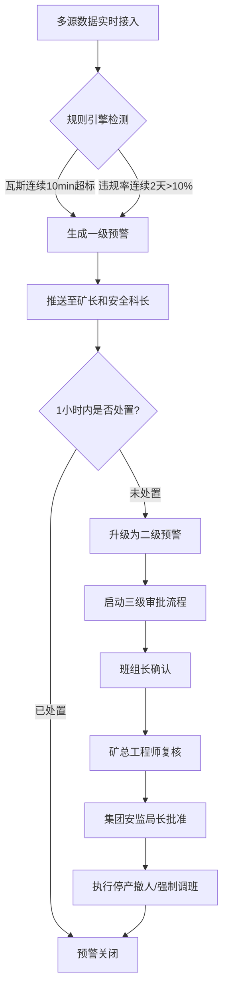
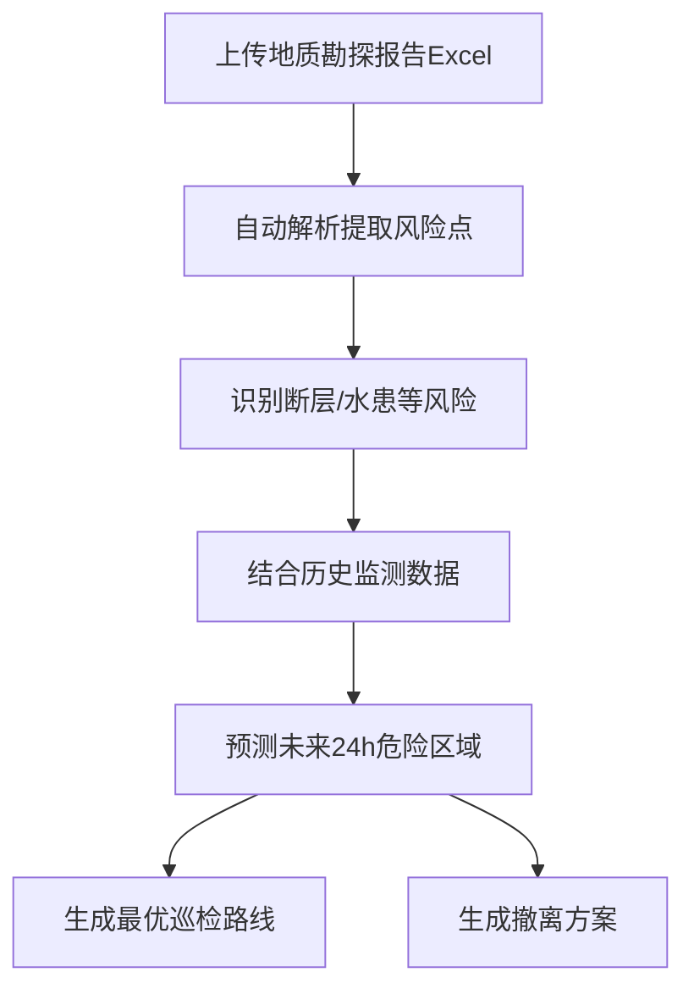

## 1. 产品概述
全国性矿山安全生产与人员定位智能监测分析平台，面向煤矿集团、矿区、班组三级用户，实时汇聚井下人员定位、瓦斯浓度、粉尘监测、风机状态及设备振动等多源数据流，提供安全指数计算、智能预警、地质风险预测和安全生产诊断报告等核心能力，实现矿山安全的全方位数字化监管。

- 解决矿山安全监管中数据分散、预警滞后、审批流程低效、隐患追踪困难等痛点
- 目标用户：集团安监局、矿级管理层（矿长/安全科长/总工程师）、班组长

## 2. 核心功能

### 2.1 用户角色
| 角色 | 注册方式 | 核心权限 |
|------|----------|----------|
| 集团级用户 | 管理员分配 | 查看全国所有矿区监测明细、统计报表，审批二级预警停产撤人 |
| 矿级用户 | 管理员分配 | 查看本矿区监测明细、预警处理、报表导出，总工程师可复核二级预警 |
| 班组级用户 | 管理员分配 | 查看本班组工作面监测数据、确认预警、巡检执行 |

### 2.2 功能模块
1. **全国安全总览看板**：全国安全指数热力图、瓦斯超限排名、按省份/矿区切换、实时安全指数/设备开机率/人员违规率/瓦斯超限时长
2. **矿区下钻详情页**：各工作面近7天瓦斯趋势曲线、人员轨迹热力图、违规类型占比饼图、工作面实时监测数据卡片
3. **预警管理中心**：一级预警自动生成、二级预警升级机制、三级审批流程（班组长确认→矿总工程师复核→集团安监局长批准）、预警历史记录
4. **地质风险分析页**：上传地质勘探报告Excel、自动提取断层/水患风险点、预测未来24小时危险区域、推荐最优巡检路线和撤离方案
5. **报表诊断中心**：每周自动生成安全生产诊断报告、违章率同比环比、设备故障类型分布、隐患整改闭环率、培训重点与巡检计划推荐

### 2.3 页面详情
| 页面名称 | 模块名称 | 功能描述 |
|----------|----------|----------|
| 全国安全总览看板 | 安全指数热力图 | 按省份着色的全国地图热力图，颜色深浅表示安全指数，支持点击下钻到矿区 |
| 全国安全总览看板 | 核心指标卡片 | 实时展示全国平均安全指数、设备开机率、人员违规率、瓦斯超限时长 |
| 全国安全总览看板 | 瓦斯超限排名 | 按矿区排列的瓦斯超限时长排行榜，Top10展示 |
| 全国安全总览看板 | 省份/矿区切换器 | 下拉选择省份过滤矿区，或直接选择矿区查看详情 |
| 矿区下钻详情页 | 工作面列表 | 展示矿区下所有工作面状态卡片（安全/预警/停产） |
| 矿区下钻详情页 | 瓦斯趋势曲线 | 近7天瓦斯浓度时序折线图，标注超限阈值线和超限区间 |
| 矿区下钻详情页 | 人员轨迹热力图 | 工作面区域平面图上叠加人员轨迹热力分布 |
| 矿区下钻详情页 | 违规类型占比 | 饼图展示各类违规（超时滞留、越界、未佩戴装备等）占比 |
| 预警管理中心 | 预警列表 | 按时间倒序展示当前所有预警，支持按级别/状态/矿区筛选 |
| 预警管理中心 | 预警详情弹窗 | 展示预警触发条件、关联数据、审批流程进度条、操作按钮 |
| 预警管理中心 | 审批流程组件 | 三级审批节点可视化（班组长→总工程师→安监局长），每步显示审批人、时间、状态 |
| 地质风险分析页 | 报告上传区 | 拖拽上传Excel文件，解析进度条，提取结果预览 |
| 地质风险分析页 | 风险点地图 | 在矿区平面图上标注断层、水患等风险点位置 |
| 地质风险分析页 | 24h危险预测 | 未来24小时危险区域渐变热力图，随时间轴播放 |
| 地质风险分析页 | 巡检路线推荐 | 在平面图上绘制推荐巡检路线，可切换撤离方案 |
| 报表诊断中心 | 周报概览 | 本周安全生产诊断报告摘要卡片 |
| 报表诊断中心 | 违章率趋势 | 同比环比折线图，按周/月切换 |
| 报表诊断中心 | 设备故障分布 | 按故障类型分类的柱状图/饼图 |
| 报表诊断中心 | 隐患整改闭环率 | 整改完成率环形进度图 |
| 报表诊断中心 | 优化建议 | 基于数据对比自动推荐的培训重点和巡检计划 |

## 3. 核心流程

### 3.1 预警触发与升级流程
当工作面瓦斯浓度连续10分钟超标或人员违规率连续2天超10%时，系统自动触发预警：

### 3.2 地质风险分析流程

## 4. 用户界面设计

### 4.1 设计风格
- **主色调**：深蓝（#0A1628）为底色，科技蓝（#00D4FF）为主强调色，警示橙（#FF6B35）和危险红（#FF3B5C）为预警色系
- **次色调**：数据绿（#00E676）表示安全/正常，暗金（#FFB300）表示关注
- **按钮风格**：圆角4px，微发光边框效果，悬停时发光增强
- **字体**：标题使用 DIN Alternate（数字仪表感），正文使用 Source Han Sans（思源黑体）
- **布局风格**：左侧导航栏 + 顶部信息条 + 主内容区，卡片式布局带玻璃拟态效果
- **图标风格**：线性图标搭配微光效果，工业/安全主题

### 4.2 页面设计概览
| 页面名称 | 模块名称 | UI元素 |
|----------|----------|--------|
| 全国安全总览看板 | 安全指数热力图 | 深色背景中国地图SVG，省份渐变着色，悬停高亮省份名称和数值，点击下钻动画 |
| 全国安全总览看板 | 核心指标卡片 | 4个玻璃拟态卡片，数字使用DIN字体大号显示，带趋势箭头和迷你折线图 |
| 全国安全总览看板 | 瓦斯超限排名 | 横向条形图，条形渐变色（蓝→橙→红），前3名高亮标记 |
| 矿区下钻详情页 | 瓦斯趋势曲线 | 暗色背景折线图，阈值线红色虚线，超限区间红色半透明填充 |
| 矿区下钻详情页 | 人员轨迹热力图 | 矿区平面底图 + 彩色热力叠加层，图例从蓝到红 |
| 矿区下钻详情页 | 违规类型占比 | 环形饼图，中心显示总违规数，各段不同色系 |
| 预警管理中心 | 审批流程组件 | 横向步骤条，节点圆形图标，连线根据审批状态变色（灰→绿→红） |
| 地质风险分析页 | 24h危险预测 | 时间轴播放器 + 热力图叠加，可拖拽时间轴预览不同时刻 |
| 报表诊断中心 | 诊断报告 | A4纸样式的报告预览区，支持导出PDF |

### 4.3 响应式设计
- 桌面优先设计，最低支持1440px宽度
- 1280-1440px适度缩减卡片间距
- 1280px以下隐藏侧边导航文字只留图标，图表自适应缩放

### 4.4 数据可视化动效
- 数据加载时使用骨架屏占位
- 数字变化使用翻牌器动效
- 图表加载使用从左到右渐进绘制动画
- 预警触发时卡片边框闪烁红光脉冲
- 热力图数据刷新使用平滑过渡动画
