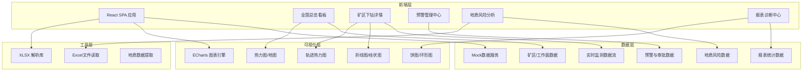
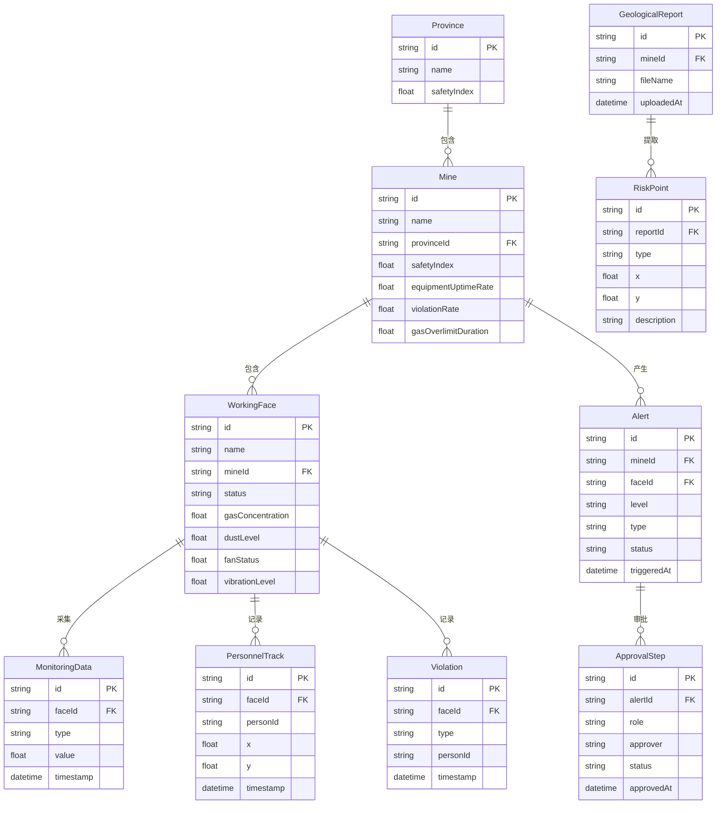

## 1. 架构设计

## 2. 技术说明
- **前端框架**：React@18 + TypeScript + Vite
- **样式方案**：Tailwind CSS@3
- **图表库**：ECharts@5（热力图、折线图、饼图、地图等）
- **路由**：React Router@6
- **状态管理**：Zustand
- **Excel解析**：SheetJS (xlsx)
- **初始化工具**：Vite
- **后端**：无，使用Mock数据模拟
- **数据库**：无，前端本地Mock数据

## 3. 路由定义
| 路由 | 用途 |
|------|------|
| `/` | 全国安全总览看板，含热力图和核心指标 |
| `/mine/:mineId` | 矿区下钻详情页，展示工作面监测数据 |
| `/alerts` | 预警管理中心，预警列表与审批流程 |
| `/geology` | 地质风险分析页，上传报告与风险预测 |
| `/reports` | 报表诊断中心，周报与统计分析 |

## 4. 数据模型

### 4.1 数据模型定义

### 4.2 Mock数据策略
- 矿区数据：覆盖山西、陕西、内蒙古、贵州、河南、安徽、山东、新疆等主要产煤省份，每省2-3个矿区
- 工作面数据：每个矿区3-5个工作面，含实时监测值
- 监测时序数据：生成近7天的分钟级瓦斯浓度数据
- 人员轨迹：生成工作面区域内的模拟轨迹点
- 预警数据：包含各级别预警实例
- 报表数据：按周生成近4周的诊断统计数据
